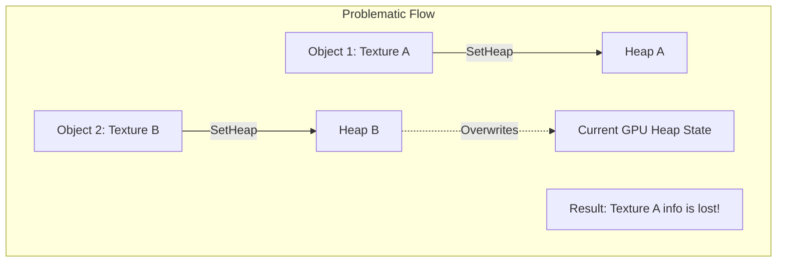
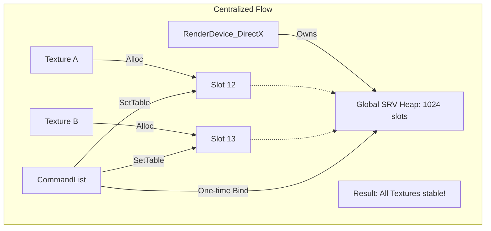

# DirectX 12 Descriptor Management: Centralized Global SRV Heap

VaEngine은 DirectX 12의 Descriptor 관리 방식을 **분산형(Decentralized)**에서 **중앙 집중형(Centralized Global Heap)**으로 리팩터링하여, 다중 텍스처 바인딩 시 발생하던 '슬롯 파괴(Overwriting)' 문제를 해결했습니다.

---

## 1. Problem: 분산형 Descriptor 관리 (Before)

초기 구현에서는 각 텍스처나 메쉬 객체가 자신만의 Descriptor Heap을 관리하거나, `SetDescriptorHeaps`를 빈번하게 호출하여 기존에 바인딩된 테이블 정보를 파괴하는 문제가 있었습니다.

### 버그 상황 (Bug Scenario)
1. **Pass A**: 텍스처 1을 바인딩하기 위해 `Heap A`를 설정.
2. **Pass B**: 텍스처 2를 바인딩하기 위해 `Heap B`를 설정.
3. **결과**: DirectX 12는 한 번에 하나의 CBV/SRV/UAV 힙만 바인딩할 수 있으므로, `Heap B`가 설정되는 순간 `Heap A`의 정보는 무효화되어 텍스처 1이 화면에서 깨지거나 사라짐.



---

## 2. Solution: 중앙 집중형 Global SRV Heap (After)

리팩터링 후에는 `RenderDevice_DirectX`가 단일 대규모 힙(1024 slots)을 소유하고, 모든 리소스는 생성 시점에 이 전역 힙의 특정 슬롯을 영구적으로 할당받습니다.

### 개선된 구조 (Improved Architecture)
- **고정 슬롯 할당**: 리소스(Texture, Buffer) 생성 시 `AllocateSRVDescriptor()`를 통해 전역 힙의 인덱스를 할당받고 GPU 핸들을 보관합니다.
- **단일 힙 바인딩**: 프레임 시작 시 전역 힙을 한 번만 바인딩하며, 이후에는 보관해둔 `GPU Handle`을 통해 `RootDescriptorTable`만 업데이트합니다.
- **안정성**: 서로 다른 리소스가 힙 슬롯을 공유하지 않으므로, 바인딩 순서나 개수에 상관없이 데이터가 안전하게 유지됩니다.



---

## 3. 구현 상세 (`RenderDevice_DirectX`)

```cpp
// RenderDevice_DirectX.h
static constexpr uint32_t GLOBAL_SRV_HEAP_SIZE = 1024;
ComPtr<ID3D12DescriptorHeap> globalSrvHeap;
uint32_t srvAllocIndex = 0;

// RenderDevice_DirectX.cpp
RenderDevice_DirectX::SRVDescriptor RenderDevice_DirectX::AllocateSRVDescriptor() {
    uint32_t idx = srvAllocIndex++; // 원자적 인덱스 할당
    // CPU/GPU Handle 계산 및 반환
}
```

---

## 4. 포트폴리오 강조 포인트
- **DX12 바인딩 모델 이해**: "한 프레임에 하나의 Descriptor Heap만 바인딩 가능"하다는 DX12의 핵심 제약 사항을 깊이 있게 이해하고 해결함.
- **리소스 안정성**: 다중 텍스처(Diffuse, Normal, Specular 등)를 사용하는 복잡한 메쉬에서도 바인딩 충돌 없이 렌더링 가능하도록 설계.
- **성능 최적화**: 매 드로우 콜마다 힙을 교체하는 부하(Heaps switching overhead)를 제거하여 렌더링 파이프라인 효율성 증대.
